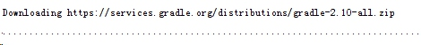

#Gradle
- 本文来自：[书生依旧](https://github.com/ssyijiu)的[Android阅读笔记](https://github.com/ssyijiu/Android-ReadingNotes)，这不是博客，只是笔记，最纯粹的干货。
- 阅读文章：[给 Android 初学者的 Gradle 知识普及](http://stormzhang.com/android/2016/07/02/gradle-for-android-beginners/)，感谢[stormzhang](http://stormzhang.com/)的无私分享。

##一.什么是Gradle
- 新一代自动化构建工具，用于对项目进行编译、运行、签名、打包、依赖管理等一系列功能的集合，一个独立的项目与AS、Android无关。
- 使用Groovy来进行描述，简洁灵活。
- 为了支持Gradle在AS上谷歌开发了一个插件：Android Gradle Plugin，在项目根目录下的build.gradle文件中有这么一行用来依赖该插件的代码：classpath 'com.android.tools.build:gradle:2.1.2' 这个版本号是gradle插件，是谷歌定的，和Gradle官方没有关系。

##二.Gradle Wrapper
- 为了解决不同项目Gradle版本不一致的问题，谷歌推出的Gradle包装，每个Android项目中都会配置一个指定版本的Gradle，通过Gradle Wrapper每个项目可以使用不同版本的Gradle来构建。

##三.AS中的Gradle配置文件
未完待续
- Module下的build.gradle：整个项目中最主要的gradle配置文件。
- Project下的build.gradle：
    ```
    classpath 'com.android.tools.build:gradle:2.1.0'
    ```
    整个项目的 gradle 基础配置文件，声明了 android gradle plugin 的版本。
- settings.gradle：
    ```
    include ':app'
    ```
    列出了项目中各个Moudle的名称，我这里没有用到其他的库所以只有一个app。
- gradle目录下的gradle-wrapper.properties：
    声明了 gradle 的目录与下载路径以及当前项目使用的 gradle 版本。

##四.正确的AS项目
- 打开各个Moudle下的build.gradle（包括library），检查ompileSdkVersion 和 buildToolsVersion是否和本地版本一直，不一致的话修改版本或者下载该版本。
- 检查 gradle-wrapper.properties，Google 有些时候要求不同的 AS 支持不同的 gradle 版本。比如 AS 1.0 的时候要求必须使用 gradle 1.x 的版本，等到 AS 2.0 的时候，Google 不支持 gradle1.x 的版本，这个时候你必须手动更新下 android gradle plugin 的版本。

##五.Gradle命令
- gradlew -v：查看当前项目的gradle版本。
- gradlew clean ：清除Project/app目录下的build文件夹（如果没有清除哪个？如果有多个Moudle会怎么样？）
- gradlew build：检查依赖并编译打包（debug、release 环境的包都打出来）
- gradlew assembleDebug ：编译并打Debug包
- gradlew assembleRelease ：编译并打Release的包
- **注意：第一次上面执行命令行，那么会出现一个下载的提示，紧接着会打印一个个的点。**
    

##六.总结
关键是理解下面三者之间的关系：
- Gradle：自动化构建工具，用于对项目进行编译、运行、签名、打包、依赖管理等一系列功能的集合，一个独立的项目与AS、Android无关。
- Android Gradle Plugin：谷歌为了支持Gradle在AS上使用开发的插件，它的版本号有谷歌规定与Gradle版本无关。
- Gradle Wrapper：通过Gradle Wrapper每个Android项目中都会配置一个指定版本的Gradle，通过Gradle Wrapper每个项目可以使用不同版本的Gradle来构建。

##联系作者
Email：ssyijiu@126.com   
微信：SSyijiu11


